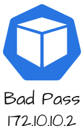

<p align="center">
  <a href="" rel="noopener">
 </a>
</p>

<h3 align="center">Retos CTF en Docker</h3>

<div align="center">

[]()

</div>

---

<p align="center"> Conjunto de diversos retos CTF centrados en el desarrollo de habilidades de escaneo de puertos y escalado de privilegios. Todos hechos en un entorno docker para facilitar el despliegue.
    <br> 
</p>

## 📝 Table of Contents

- [About](#about)
- [Getting Started](#getting_started)
- [Deployment](#deployment)
- [Usage](#usage)
- [Built Using](#built_using)
- [TODO](../TODO.md)
- [Contributing](../CONTRIBUTING.md)
- [Authors](#authors)
- [Acknowledgments](#acknowledgement)

## 🧐 About <a name = "about"></a>

Este proyecto se ha desarroyado como Trabajo Final de Master por la Universidad Internacional de Valencia.

En proyecto constará de una serie de retos divididos en diversos contenedores. Para cada reto se le asignara una o varias flags y una seríe de pistas para guiar en caso de atasco.

## 🏁 Getting Started <a name = "getting_started"></a>

Estas instrucciones ayudarán al despliegue del proyecto mirar las notas de [deployment](#deployment) para desplegar el sistema.

### Prerequisites

Para poder hacer uso del proyecto es necesario tener instalador docker en el sistema.

```
sudo apt-get update
sudo apt-get install docker-ce docker-ce-cli containerd.io docker-buildx-plugin docker-compose-plugin
```

## Deployment <a name = "Deployment"></a>

Para tener el proyecto en el sistema tan solo hay que estar en el directorio del repositorio y ejecutar el docker-composer

Paso a paso sería así:

```
git clone https://github.com/Newolfdark/TFM_Alejandro_Palacios.git
cd TFM_Alejandro_Palacios
docker-composer up -d
```

End with an example of getting some data out of the system or using it for a little demo.

## 🔧 Running the tests <a name = "tests"></a>

Para hacer pruebas de que se ha instalado correctamente podemos ver si se han generado contenedores o imagenes.

### Comprobar si se han generado Contenedores o imagenes

```
docker ps -a
docker images
```
Si tenemos contenedores con el "status" en "running" significa que se puede continuar con los retos CTF en caso contrario revisar la instalación.

## 🎈 Usage <a name="usage"></a>

Una vez instalado el proyecto y puesto en marcha la idea es intentar conseguir todas las "flags" posibles mediante nuestras habilidades de "hacking". Para ello se pueden usar las distitas Ips de los contenedores, voy a dejar un esquema indicando las ips de los diferentes contenedores y su titulo.

</a>

## 🚀 Deployment <a name = "deployment"></a>

Add additional notes about how to deploy this on a live system.

## ⛏️ Built Using <a name = "built_using"></a>

- [Docker](https://www.docker.com/) - Containers
- [Docker-compose](https://docs.docker.com/compose/) - Containers conexion

## ✍️ Authors <a name = "authors"></a>

- [@newofldark](https://github.com/newolfdark) - Idea & Initial work

See also the list of [contributors](https://github.com/kylelobo/The-Documentation-Compendium/contributors) who participated in this project.

## 🎉 Acknowledgements <a name = "acknowledgement"></a>

- Stackoverflow 
