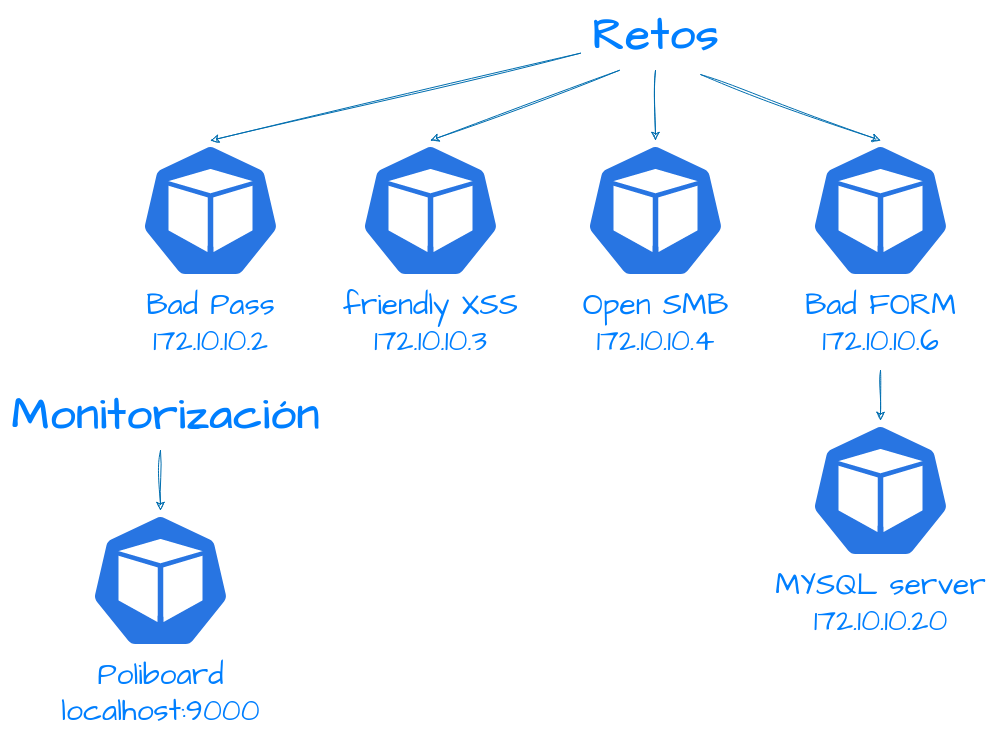

<p align="center">
  <a href="" rel="noopener">
 </a>
</p>

<h3 align="center">Retos CTF en Docker</h3>

<div align="center">

[]()

</div>

---

<p align="center"> Conjunto de diversos retos CTF centrados en el desarrollo de habilidades de escaneo de puertos y escalado de privilegios. Todos hechos en un entorno docker para facilitar el despliegue.
    <br> 
</p>

## 📝 Table of Contents

- [About](#about)
- [Getting Started](#getting_started)
- [Deployment](#deployment)
- [Usage](#usage)
- [Built Using](#built_using)
- [TODO](#todo)
- [Authors](#authors)
- [Acknowledgments](#acknowledgement)

## 🧐 About <a name = "about"></a>

Este proyecto se ha desarrollado como Trabajo Final de Máster por la Universidad Internacional de Valencia.

En proyecto constará de una serie de retos divididos en diversos contenedores. Para cada reto se le asignará una o varias flags y una serie de pistas para guiar en caso de atasco.

En todo caso queda prohibida la visualización de código de los dockerfiles, ya que los retos perderían todo el sentido (Pero solo los ficheros de este repositorio, los diferentes códigos html si que se pueden visualizar a través del navegador u otras herramientas como Burpsuite).

Por ahora los retos disponibles son:

Retos simples:

- CTF1: Se trata de un docker que contiene un servidor SSH poco seguro...
- CTF2: Es posible que tenga un servidor apache y tenga un web dudosa...
- CTF3: Hay un posible SMB con información de fácil acceso...
- CTF4: Un servidor apache con un panel de inicio de sesión con dudosa fiabilidad...
- CTF5: Un servidor ftp con información delicada...
- CTF6: Un mensaje poco claro...
- CTF7: Una página que incita a un tipo de vulnerabilidad muy conocida...
- CTF8: Una página que esconde un doc...

Retos compuestos simples: Por ahora hay 4. Los retos compuestos simples tratan de combinaciones de dos retos simples.

Retos compuestos avanzados: Por ahora hay 1. Los retos compuestos avanzados tratan de la combinación de tres o más retos simples.

¡Espero que os gusten!

## 🏁 Getting Started <a name = "getting_started"></a>

Estas instrucciones ayudarán al despliegue del proyecto mirar las notas de [deployment](#deployment) para desplegar el sistema.

### Prerequisites

Para poder hacer uso del proyecto es necesario tener instalado docker en el sistema.

```
sudo apt-get update
sudo apt install -y docker.io docker-compose
sudo systemctl enable docker --now
```
Opcional (pero recomendado):

Añadir usuario al grupo de docker (para no tener que ejecutar los comandos con sudo).

```
usermod -aG docker $USER
```

## 🚀 Deployment <a name = "deployment"></a>

Para tener el proyecto en el sistema tan solo hay que estar en el directorio del repositorio y ejecutar el docker-composer

Paso a paso sería así, para el despliegue de todos los retos simples:

```
git clone https://github.com/Newolfdark/TFM_Alejandro_Palacios.git
cd TFM_Alejandro_Palacios/Retos_Simples
docker-composer up -d
```

Para el despliegue de retos compuestos tanto simples como avanzados el procedemiento es el mismo pero cambiando la instrucción ''cd'' al reto compuesto que se desea. Por ejemplo para el reto compuesto simple 1 sería

```
cd TFM_Alejandro_Palacios/Compuestos_Simples/Compuesto_Simple\ 1/
docker-composer up -d
```

## 🔧 Running the tests <a name = "tests"></a>

Para hacer pruebas de que se ha instalado correctamente podemos ver si se han generado contenedores o imágenes.

### Comprobar si se han generado Contenedores o imagenes

```
docker ps -a
docker images
```
Si tenemos contenedores con el "status" en "running" significa que se puede continuar con los retos CTF en caso contrario revisar la instalación.

### Borrar todos los contenedores e imagenes generadas

```
docker rm $(docker ps -aq) -f
docker rmi $(docker images -q)
```

También es importante borrar las redes que se han creado a la hora de ejecutar un ''docker-compose'' para ello podemos ejecutar:

```
docker network ls -q | xargs docker network rm
```


## 🎈 Usage <a name="usage"></a>

Una vez instalado el proyecto y puesto en marcha, la idea es intentar conseguir todas las "flags" posibles mediante nuestras habilidades de "hacking". Para ello se pueden usar las distintas IPs de los contenedores, voy a dejar un esquema indicando las IPs de los diferentes contenedores y su título.

</a>

## 👨‍🏭 TODO <a name = "built_using"></a>

Creación de retos compuestos simples y avanzados.

## ⛏️ Built Using <a name = "built_using"></a>

- [Docker](https://www.docker.com/) - Containers
- [Docker-compose](https://docs.docker.com/compose/) - Containers conexion

## ✍️ Authors <a name = "authors"></a>

- [@newofldark](https://github.com/newolfdark) - Idea & Initial work

## 🎉 Acknowledgements <a name = "acknowledgement"></a>

- https://stackoverflow.com
- https://github.com/moeinfatehi/xss_vulnerability_challenges
- https://hub.docker.com/r/dperson/samba
- https://www.section.io/engineering-education/dockerized-php-apache-and-mysql-container-development-environment/
- https://github.com/thomaslaurenson/startrek_payroll/tree/main
